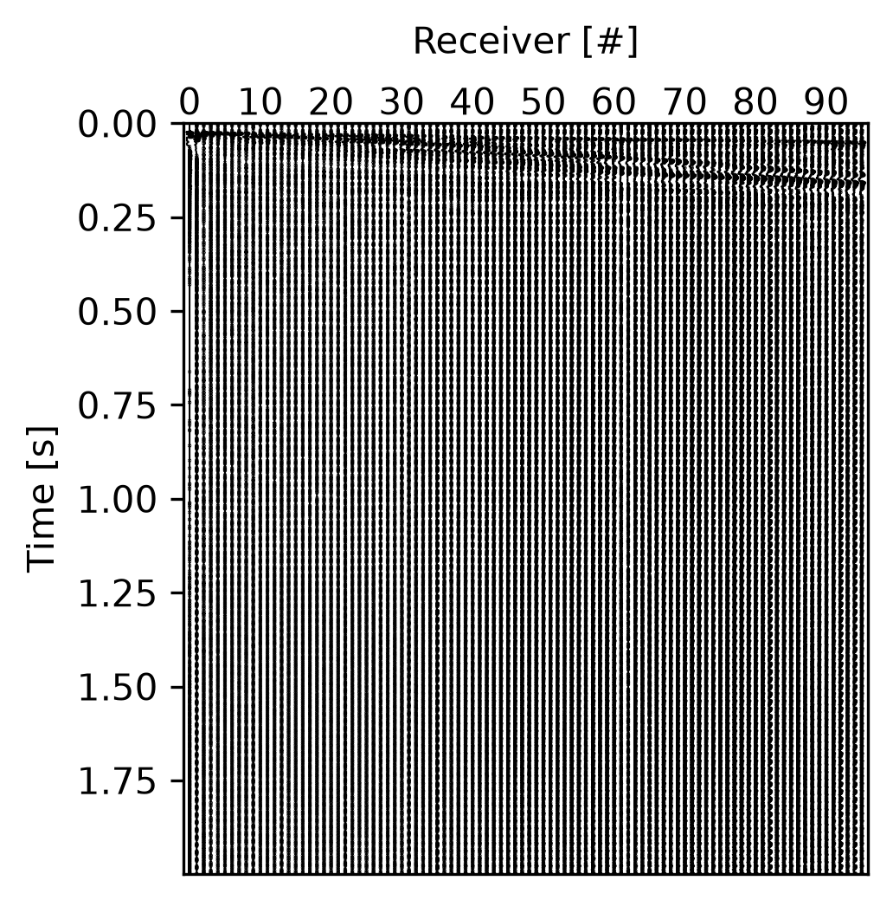

# G1: signal QC, per record

Runs on each preprocessed record (`records/<record>/Stream_0000.hdf5`), after S1 (trigger
correction, detrend, mute, filter). On a passive record, only the checks that need no trigger:
dead, clipped and NaN traces. Code: `src/paco/qc/g1_signal.py`; thresholds: `signal` in
`qc_config.json` (`SignalThresholds`); tests: `tests/test_qc_signal.py`, on synthetic shots
with one defect planted at a time.

## What it checks

The surface-wave window of each trace runs from the arrival at `vg_max` to the arrival at
`vg_min` (80 to 1,500 m/s by default), padded by 50 ms. The noise window is before the trigger
when the record has samples there, else after the slowest arrival, when the record is long
enough; the result says which one was used.

| Metric | Threshold (default) | Why |
|---|---|---|
| `dead_traces` | RMS below 1 % of the record's median RMS | A dead geophone: no parameter improves it |
| `clipped_traces` | more than 0.5 % of the samples at the trace's extreme | Saturation: the waveform is lost |
| `nan_traces` | any NaN | Unusable |
| `rms_outliers` | log RMS off the Theil–Sen fit of log RMS against log offset by more than 3 MADs **and** a factor 2 | Bad coupling; the factor keeps a smooth decay's tiny MADs from flagging everything |
| `snr_db` | median over the traces of the energy per sample in the signal window over the noise window, at least 6 dB | Below it the image is mostly noise |
| `usable_band_hz` | the band, around the spectral peak, where the signal windows' spectrum exceeds the noise windows' by 6 dB and stays within 20 dB of its peak | What S2's band may span; the peak rule is needed because after the wave the noise window is quieter than the signal window at every frequency |
| `lateral_coherence` | median over neighbouring pairs of the peak normalized cross-correlation in the window, within the moveout of one spacing at `vg_min`, at least 0.5 | Noisy or scattered records |
| `reversed_traces` | a trace whose peak correlation with both neighbours is negative | Reversed polarity: excluded |
| `trigger_shift_s` | first breaks (envelope smoothed over 5 ms above 5 x the noise RMS, on traces whose SNR passes) fitted as t = t0 + x / v (Theil–Sen): abs(t0) at most 10 ms | A delay the same on every trace is corrected in S1 (`trigger.t0`) |
| `trigger_scatter_s` | 1.4826 x the MAD of the breaks about their line, at most 50 ms | Beyond it the breaks are no line: the record is rejected |
| `energy_removed` | reported, not judged | The share of energy the preprocessing removed (rule 6) |

Actions: exclude traces (dead, clipped, NaN, off the decay, reversed), exclude the record
(no noise window, inconsistent trigger), an override of the preprocessing (a filter to the
usable band or a mute when the SNR or the coherence is low; `trigger.t0` for a delay).
Verdict: `reject` when a flag excludes the record, `retry` when a flag can be acted on,
`pass` otherwise. `kept`: the usable band and the traces kept.

## On the demo profile

`active_p1`, both records, PACo's defaults (2026-09-24):

| Record | Verdict | SNR | Usable band | Coherence | Trigger | Flags |
|---|---|---|---|---|---|---|
| 1.dat | retry | 10.0 dB | 0–350 Hz | 0.88 | +18.8 ms, scatter 1.4 ms | `shifted_trigger` -> `preprocessing {"trigger": {"t0": 0.0188}}` |
| 2.dat | retry | 9.4 dB | 0–324 Hz | 0.95 | +10.4 ms, scatter 6.4 ms | `shifted_trigger` -> `{"trigger": {"t0": 0.0104}}`; `rms_outliers` -> exclude traces 1, 89, 90 |

Both records are triggered late: the first break on the 0.75 m trace comes at 19 to 21 ms,
where a direct wave takes about 1 ms. The corrections are the same on every trace (scatter 1.4
and 6.4 ms). Record 2's three traces off the decay are one far trace (24.25 m) 2.3 times louder
than its neighbours and the two nearest (2.0 and 2.25 m), in the near field. The SNR of 10 dB
is a median: the traces near the source reach 40 to 55 dB, the far ones fall to -1 dB.



The summary the agent reads, for the two records:

```
G1: 2 retry
G1 shifted_trigger, 1.dat, 2.dat: The first breaks put the trigger at 19 ms, the same on every
  trace: correct the record's time origin by it. -> preprocessing {"trigger":{"t0":0.0188}}
G1 rms_outliers, 2.dat: Traces [1, 89, 90] have an amplitude far off the decay with offset: bad
  coupling, not a parameter. -> exclude traces [1, 89, 90] of 2.dat
```

`passive_p1`: both records pass the three checks that run without a trigger.

## On synthetic shots (the tests)

A causal wavelet at 200 m/s over white noise, 24 traces 1 m apart:

- clean: pass, SNR 16 dB, coherence 0.97, trigger 1 ms, usable band around 20 Hz;
- a zeroed trace, a clipped trace, a NaN: found and excluded, verdict retry;
- a trace 30 times louder: the only outlier, its neighbours untouched;
- noise of RMS 1 against a wave peaking at 1: `low_snr`;
- a trace with its sign flipped: `reversed_polarity`;
- a shot triggered 50 ms late: `shifted_trigger` with t0 = 0.050, and the record corrected by
  that t0 passes;
- each trace shifted by its own -150 to 150 ms: `inconsistent_trigger`, rejected.

## To judge

- Is 10 ms the right limit for a trigger correction, and 50 ms for "not a line"?
- Should the near-field traces (offsets below half the longest wavelength) be left out of the
  decay fit, so that they are never "off the decay"?
- The usable band starts at 0 Hz on the demo records: is a lower edge wanted (the geophones'
  natural frequency)?
