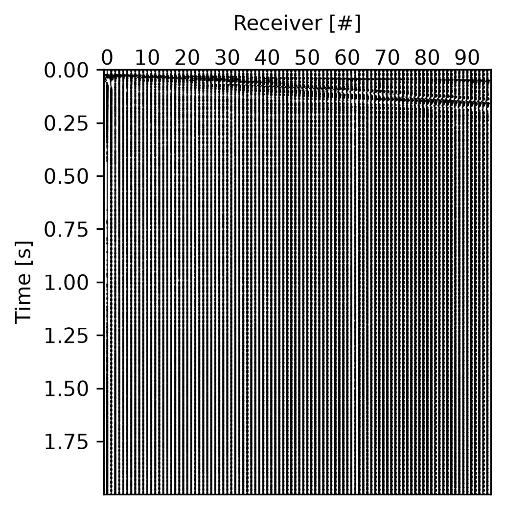

# G1: signal QC, per record

Runs on each preprocessed record (`records/<record>/Stream_0000.hdf5`), after S1 (trigger
correction, detrend, mute, filter). On a passive record, only the checks that need no trigger:
dead, clipped and NaN traces. Code: `src/paco/qc/g1_signal.py`; thresholds: `signal` in
`qc_config.json` (`SignalThresholds`); tests: `tests/test_qc_signal.py`, on synthetic shots
with one defect planted at a time.

## What it checks

The surface-wave window of each trace runs from the arrival at `vg_max` to the arrival at
`vg_min` (80 to 1,500 m/s by default), padded by 50 ms. The noise window is before the trigger
when the record has samples there, else after the slowest arrival, when the record is long
enough; the result says which one was used. On a muted record, the SNR, the usable band and the
line's reach measure the noise on the record before its muting (below, 2026-09-29).

| Metric | Threshold (default) | Why |
|---|---|---|
| `dead_traces` | RMS below 1 % of the record's median RMS | A dead geophone: no parameter improves it |
| `clipped_traces` | more than 0.5 % of the samples at the trace's extreme | Saturation: the waveform is lost |
| `nan_traces` | any NaN | Unusable |
| `rms_outliers` | log RMS off the Theil–Sen fit of log RMS against log offset by more than 3 MADs **and** a factor 2; the fit runs on every trace within the line's reach (below) that is neither dead, clipped nor NaN, those already excluded included | Bad coupling; the factor keeps a smooth decay's tiny MADs from flagging everything. A fit without the excluded traces moved at each round and excluded more (21 traces around each shot of `active_p2`); a fit over a long line's noise flattened, and the strongest traces next to the shot read too loud |
| `snr_db` | median over the traces within the line's reach (below) of the energy per sample in the signal window over the noise window, at least 6 dB | Below it the image is mostly noise. Traces beyond the reach go into no window's stack: a long line's far traces are not the record's fault |
| `usable_band_hz` | the band, around the spectral peak, where the signal windows' spectrum exceeds the noise windows' by 6 dB and stays within 20 dB of its peak, over the traces within the reach | What S2's band may span; the peak rule is needed because after the wave the noise window is quieter than the signal window at every frequency |
| `lateral_coherence` | median over neighbouring pairs within the reach of the peak normalized cross-correlation in the window, within the moveout of one spacing at `vg_min`, at least 0.5 | Noisy or scattered records |
| `trigger_shift_s` | first breaks (envelope smoothed over 5 ms above 5 x the noise RMS, on traces whose SNR passes) fitted as t = t0 + x / v (Theil–Sen): abs(t0) at most 10 ms | A delay the same on every trace is corrected in S1 (`trigger.t0`) |
| `trigger_scatter_s` | 1.4826 x the MAD of the breaks about their line, at most 50 ms | Beyond it the breaks are no line: the record is rejected |
| `energy_removed` | reported, not judged | The share of energy the preprocessing removed (rule 6) |

**The line's reach** (`snr_reach`, measured by `process_line` before G1 judges the records):
each trace's SNR (the same windows) over every active record, binned by distance from the shot
every fifteenth of the line; the reach is where the bins' median falls under `reach_snr_db`
(2 dB), interpolated between the last bin above and the first below. It sets S2's
`masw.distance_max` unless the user gave one (the windows stack no farther shot), and G1 judges
the decay, the SNR, the usable band and the coherence within it. None on a passive line, or
when no bin falls under 2 dB.

Actions: exclude traces (dead, clipped, NaN, off the decay), exclude the record
(no noise window, inconsistent trigger), an override of the preprocessing (a filter to the
usable band or a mute when the SNR or the coherence is low; `trigger.t0` for a delay).
Verdict: `reject` when a flag excludes the record, `retry` when a flag can be acted on,
`pass` otherwise. `kept`: the usable band and the traces kept. A record still asking for a
retry once its budget is spent is rejected ("budget spent") and goes into no window (since
2026-09-25: `active_p2`'s three shots whose SNR a filter did not raise were stacked all the
same).

## The line's receivers (since 2026-09-26)

A trace off the amplitude decay with offset in one record is reported, not left out: next to
the shot, such traces were artifacts of the shot, not bad receivers (about 40 % of p2's
exclusions). A receiver is left out of every window only when it is off the decay in at least
half the records that reach it, and in at least 3 of them: a line-level check, unit `line`, flag
`off_decay_receivers`. On p2: the receiver at 45 m, off in 37 of its 69 records (a badly coupled
geophone, the user confirmed). The near field is no longer a reason to leave traces out: it sets
the nearest shot a window stacks (`S2_rules.md`).

## On the demo profile

`active_p1`, both records, PACo's defaults (2026-09-24):

| Record | Verdict | SNR | Usable band | Coherence | Trigger | Flags |
|---|---|---|---|---|---|---|
| 1.dat | retry | 10.0 dB | 0–350 Hz | 0.88 | +18.8 ms, scatter 1.4 ms | `shifted_trigger` -> `preprocessing {"trigger": {"t0": 0.0188}}` |
| 2.dat | retry | 9.4 dB | 0–324 Hz | 0.95 | +10.4 ms, scatter 6.4 ms | `shifted_trigger` -> `{"trigger": {"t0": 0.0104}}`; `rms_outliers` -> exclude traces 1, 89, 90 |

Both records are triggered late: the first break on the 0.75 m trace comes at 19 to 21 ms,
where a direct wave takes about 1 ms. The corrections are the same on every trace (scatter 1.4
and 6.4 ms). Record 2's three traces off the decay are one far trace (24.25 m) 2.3 times louder
than its neighbours and the two nearest (2.0 and 2.25 m), in the near field. The SNR of 10 dB
is a median: the traces near the source reach 40 to 55 dB, the far ones fall to -1 dB.



The summary the agent reads, for the two records:

```
G1: 2 retry
G1 shifted_trigger, 1.dat, 2.dat: The first breaks put the trigger at 19 ms, the same on every
  trace: correct the record's time origin by it. -> preprocessing {"trigger":{"t0":0.0188}}
G1 rms_outliers, 2.dat: Traces [1, 89, 90] have an amplitude far off the decay with offset: bad
  coupling, not a parameter. -> exclude traces [1, 89, 90] of 2.dat
```

`passive_p1`: both records pass the three checks that run without a trigger.

The demo's reach at 2 dB is 24.34 m: its far shot (21.6 m from the far windows) stays in their
stack. At 6 dB it was 17.7 m, and the line's two end windows lost that shot and their curves.
Each record's farthest trace (24.5 m) lies just beyond the reach, so since the decay is fitted
within it, 2.dat's trace 13 (21.25 m, 2.40 times above the decay, against a limit of 2.40) is
excluded too: 2.dat leaves out traces 1, 13, 89 and 90. On the line of four 24-receiver
windows, xmid 2.88 then loses its curve (3 of 4); with no settings the ladder still proposes 11
receivers, and 74 of the 86 windows give a curve (the user kept the rule, 2026-09-25).

## On a real survey

`active_p2` (2026-09-25): 96 receivers every 1.5 m (142.5 m), 97 shots from -0.75 to 143.25 m
every 1.5 m, 3 s at 2,000 Hz. The traces' median SNR falls from 53 dB within 10 m of the shot to
7 dB at 40 to 50 m, 5 dB at 50 to 60 m, about 0.5 dB beyond 70 m. The reach at 2 dB is 63.35 m.

- Judged over whole records, G1 rejected 52 of the 97 for a median SNR under 6 dB: their near
  traces are strong, most of the line is noise. Within the reach, 94 pass and 3 are rejected.
- The reversed-polarity check flagged blocks of traces next to every shot: at 1.5 m spacing near
  the source, neighbours shifted by more than half a period correlate negatively. Removed.
- The decay fit without the traces it had just excluded moved at each round and excluded 21
  traces around each shot. The fit now keeps them.
- Fitted over all 96 traces, most of them noise, the decay flattened, and the traces next to
  each shot, the strongest (up to 73 dB), read too loud: 360 traces excluded, 259 of them within
  10 m of the shot. Within the reach: 131, 70 within 10 m (mostly the nearest one or two, the
  near field), and receiver 30, loud on most shots, still found (38 records).
- The records' usable bands: the median 2.3 to 298 Hz; the worst record's 24 to 86 Hz, which the
  band cap used until then (`S2_rules.md`).

## On synthetic shots (the tests)

A causal wavelet at 200 m/s over white noise, 24 traces 1 m apart:

- clean: pass, SNR 16 dB, coherence 0.97, trigger 1 ms, usable band around 20 Hz;
- a zeroed trace, a clipped trace, a NaN: found and excluded, verdict retry;
- a trace 30 times louder: the only outlier, its neighbours untouched;
- noise of RMS 1 against a wave peaking at 1: `low_snr`;
- a shot triggered 50 ms late: `shifted_trigger` with t0 = 0.050, and the record corrected by
  that t0 passes;
- each trace shifted by its own -150 to 150 ms: `inconsistent_trigger`, rejected.

## Decided

- Kept as they are (the user, 2026-09-25): 10 ms for a trigger correction and 50 ms for "not a
  line", and no lower edge to the usable band (the pick stops where its ridge breaks, 8.5 to
  10 Hz at the lowest on the demo).
- The near field is not left out of the decay fit (the user, 2026-09-25, after a try): the
  longest wavelength a curve keeps is not known at G1, before any image. The record's dominant
  wavelength (the phase velocity at its spectrum's peak) was 6.2 m on 1.dat and 1.8 m on 2.dat,
  whose spectrum peaks high next to the shot: its near field (0.9 m) missed traces 89 and 90
  (2.0 and 2.25 m), the case the rule was for, and on 1.dat leaving the near traces out of the
  robust fit flagged trace 62 instead. Two traces of 96 left out cost little; G3's `near_field`
  reports the near field's effect on the curves.
- G1's retries count against each record's own budget, not the windows' run budget (the user,
  2026-09-25): a line of 97 shots spent the run's budget on records before any window.
- The SNR and the usable band within the line's reach, the reach at 2 dB of median SNR setting
  `masw.distance_max` (the user, 2026-09-25, on `active_p2`). Rejected: PAC's 100 m, where
  `active_p2`'s traces are noise beyond about 60 m; every shot of the line (1,000 m, PACo's
  default until then); excluding the traces under 6 dB instead of rejecting records; 6 dB and
  3 dB for the reach (at 6 dB the demo's end windows lost their far shot).
- The decay fitted within the reach too (the user, 2026-09-25), with the coherence: on a long
  line the far noise flattened the fit. Kept after the demo's cost was measured (above).
  Rejected: the fit over every trace; within the reach only where it cuts the line.
- No reversed-polarity check (the user, 2026-09-25: "in geophysics this will likely never
  happen"): on `active_p2` it flagged the traces next to each shot, whose neighbours are shifted
  by more than half a period. A geophone wired backwards would show as a trace G2 and G3 cannot
  explain; none was found on either line.

## The trigger from the files, part of the muting (2026-09-28)

The user asked for the trigger the records' files state, and for it to belong to the muting: "no
trigger if I put mute to off". sigpipe reads each record's trigger from its file (SEG-2's
`DELAY`, optional: a file may not say it); the demo's and the user's lines all say 20 ms, the
delay the first breaks found above. With the muting on, the preprocessing moves each record's
time origin by it (or by a `trigger.t0` given; 0 for a file that says none); off, it leaves the
record as recorded. So G1 expects the shot at 0 on a muted record, and where its file says on
the others: `trigger_shift_s` is the first breaks' shot time off that (1.dat: 18.8 ms measured
against 20 ms, -1.2 ms). Only a muted record's trigger is corrected (`shifted_trigger`, its t0
the shift applied plus the one measured); unmuted, nothing uses it, and the measure is only
reported.

The shot's pulse (`pulse_s`, reported): how long its energy lasts after the first break, where
the envelope falls back below a tenth of its peak (`pulse_ratio`), the median over the three
traces nearest the shot that show one (`pulse_traces`), within half a second (`max_pulse_s`).
Measured on a record not muted, a mute would cut it; on the demo, 0.05 to 0.15 s (active_p2's
first twelve shots, median 0.08 s). Every mute a gate suggests leaves its width out: when the
records are done again (G1's own retries, a backtrack), each record's mute keeps its own pulse
after the slowest arrival, else the line's median pulse, else 50 ms (`mute_width_s`) when no
record's could be measured (the user, 2026-09-28; `shots.py`). A width the user gives stays.

## A passive or passive-active line's spectra (2026-09-28)

Each record's traces against their neighbours' spectra (sigpipe's `spectral_deviations`: Welch's
spectra, two neighbours each side, 2 Hz to 0.8 of Nyquist): a trace sitting more than 6 dB from
theirs (the median of the differences: a gain or a response of its own), or dropping 15 dB under
them over more than a tenth of the band (a dead band). A noise record's traces are compared by
level and shape; a shot's (passive-active) by shape alone, the five nearest the shot aside
(louder and brighter by their distance alone). Each record reports how many are off
(`spectral_outliers`); the line flags a receiver off in half the records judging it or more
(`spectral_receivers`), and keeps it (the user: flag, not alter the workflow). On the demo, a
passive trace sits 1 dB from its neighbours (3.4 at the 99th percentile), a shot's 1.7 (5.6);
active_p2's receiver 20 stands out in several shots (4.7 to 7.3 dB).

## The noise before the muting (2026-09-29)

A muting zeroes the noise window after the slowest arrival: measured there, a muted record's
median SNR read some 360 dB, whatever its noise (the user's line: the four records G1 had muted
for their coherence; PAC's passive-active run, 352 dB). The user: "it could measure its noise
before muting instead: yes". So on a muted record, the SNR, the usable band and the line's
reach measure the noise on the record before its muting: preprocessed as its latest attempt
had it, from its input file, neither muted nor its trigger shifted (the shift, part of the
muting, drops the samples before the trigger), its shot later by that shift (sigpipe's
`unmuted_record`, `trigger_shift_s`; `judging.before_muting`). The other measures stay on the
muted record, as the windows use it: dead, clipped and NaN traces, the decay, the coherence,
the first breaks. Measured all before the muting, three of those four records fell under the
coherence limit (0.48 to 0.50, the mute had lifted them to 0.51 to 0.56) and a new run would
leave them out; the user had asked for the noise alone.

On the user's run (`active_p2` 20260927-094830-487e, 97 records, the line's reach 63.35 m),
only the four muted records are measured otherwise, and no verdict changes:

| Record | SNR, muted | SNR, noise before the muting | Usable band, muted | before the muting | Verdict |
|---|---|---|---|---|---|
| 117.dat | 364.8 dB | 19.2 dB | 0-306 Hz | 14-200 Hz | pass |
| 120.dat | 364.1 dB | 12.7 dB | 0-285 Hz | 14-208 Hz | pass |
| 121.dat | 364.2 dB | 15.9 dB | 0-325 Hz | 14-266 Hz | retry (coherence 0.49) |
| 167.dat | 359.5 dB | 18.3 dB | 0-204 Hz | 13-201 Hz | pass |

Each record's spectra are drawn beside it when G1 judges it (`Spectrum_0000.png`, archived
with the record's attempt): the preprocessed record's traces, each trace's amplitude spectrum
at its receiver scaled to its own largest, 0 to Nyquist, bone reversed; G1's usable band dashed,
no title (the user: "a 2d plot traces, freq and amplitude"; "reverse the colorbar"; "the
spectrum and record after preprocessing"; "remove title on spectrum plot").
