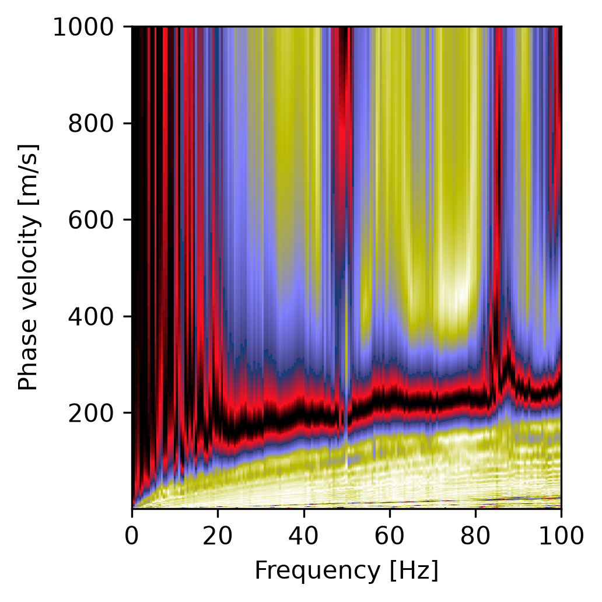

# G2: dispersion image QC, per window

Runs on each window's image (`xmid_<x>/DispersionImage_0000.hdf5`), before any picking. Code:
`src/paco/qc/g2_image.py`; thresholds: `image` in `qc_config.json` (`ImageThresholds`); tests:
`tests/test_qc_image.py`, on analytic images (Gaussian ridges over the noise floor).

## What it checks

The noise floor of a phase-shift image is 1 / sqrt(N) for N receivers: random phases sum to
about that, not to 0. The most a plane wave gives is 1.

| Metric | Threshold (default) | Why |
|---|---|---|
| `coherent_columns` | a column (one frequency) is coherent when its peak lies 30 % of the way from the floor to 1; at least 50 % of the columns | The share of the band with a ridge to pick. A level, not a multiple of the floor: with 5 receivers the floor is 0.45, and 3 x the floor is above 1 |
| `ridge_at_vmin`, `ridge_at_vmax` | at most 20 % of the coherent columns peak within 2 % of the velocity range of the grid's edge | The velocity range is too narrow, or, at a vmin below 30 m/s, an artifact (a correlation's zero lag): then the range starts above it |
| `band_at_fmin`, `band_at_fmax` | the coherent band must not reach the image's first or last frequency | The band may go on beyond the image. `band_at_fmax` is kept, not retried (milestone 13): widening the band made G3 worse on the demo |
| `competing_ridges` | a second local maximum reaching 70 % of the first, at least 15 % away in velocity, in at most 70 % of the coherent columns | A higher mode dominating (pick two modes), or, when the first ridge lies below the aliasing limit v = 2 dx f, an alias: the band is cut where the alias starts |
| `band_share_of_usable` | the coherent band at least half of G1's usable band (the narrowest over the window's records) | The image does not use all the records offer: reported (`narrower_than_usable`, kept since milestone 13) |

Actions: an override of the phase shift (`dispersion.vmin`, `vmax`, `fmin`), of the picking
(`max_modes`), or of the preprocessing (a surface-wave mute); the two band flags are kept.
Verdict: `retry` when a flag asks for a change, `pass` otherwise (kept flags only); G2 never
rejects by itself. `kept`: the coherent band and the window's receivers.

**Milestone 14 made the grid come first.** With a velocity range too narrow for the ground
(vmax at 150 m/s where the demo reaches 290), the correlation's artifact at 1 m/s outweighed the
truncated ridge: G2 took it for an alias and cut the band to 12 Hz. The edge, competing-ridge and
alias checks now look above `vmin_floor` (30 m/s) only, and no second ridge is judged while a
ridge sits on the grid's edge (`docs/gates/loop.md`).

**Milestone 13 changed the band flags** (the user's decision, with the measurements of
`S2_rules.md`): on active_p1, G3 passed 17 of 19 windows at PAC's 100 Hz, 15 at 150 Hz (G2's
own retry, fmax x 1.5) and 6 at 324 Hz (G1's usable band), since above 100 Hz a second ridge
competes and the picker jumps. So `band_at_fmax` and `narrower_than_usable` are now reported,
never retried, and the coherence rules cap fmax at G1's usable band before S2.

## On the demo profile

`active_p1`, windows of 24 receivers every 24, PACo's defaults (2026-09-24), the four windows
alike:

| Metric | xmid 2.88 | Passed |
|---|---|---|
| `coherent_columns` | 0.995 | yes |
| `ridge_at_vmin` | 0.01 | yes |
| `ridge_at_vmax` | 0.04 | yes |
| `band_at_fmin` | no | yes |
| `band_at_fmax` | reached | **no** |
| `competing_ridges` | 0.56 | yes |
| `band_share_of_usable` | 0.31 (0.5–100 Hz of 0–324 Hz) | **no** |



The summary the agent reads (since milestone 13):

```
G2: 4 pass
G2 band_at_fmax, xmid 2.88-20.88 (4): The coherent band reaches the image's highest frequency:
  the band may go on beyond it. -> keep: fmax stays: a wider band let other ridges compete
G2 narrower_than_usable, xmid 2.88-20.88 (4): The coherent band 0.5-100.0 Hz is 31% of the
  records' usable band 0.0-324.0 Hz: the image does not use all the data offers. -> keep: the
  band is capped, never widened: see band_at_fmax
```

The records are usable to 324 Hz while PAC's default image stops at 100 Hz. Until milestone 13
the loop's first move would have been to widen `fmax`; measured, that lost curves (above).

With PACo's default windows of 5 receivers (every receiver, 92 windows): 92 to 99 % of the
columns coherent, 87 to 95 % with a second ridge (the 1 m aperture cannot separate ridges),
the band flags as above. `passive_p1`, 24-receiver windows: 20 to 60 % of the columns peak at
vmin = 1 m/s, an artifact, so the range is moved to start at 30 m/s; two windows peak at vmax
as well; one shows aliasing.

## On analytic images (the tests)

A Gaussian ridge along a known M0 over the floor of 48 receivers, 10 to 40 Hz:

- a ridge that fades at 15 and 35 Hz: pass, band 15–35 Hz, 41 of 61 columns coherent;
- the same ridge 900 m/s higher, beyond the grid's 1,000 m/s: `ridge_at_vmax` -> vmax 1,500;
- a ridge reaching 40 Hz: `band_at_fmax`, kept, pass; reaching 10 Hz: `band_at_fmin` -> fmin 5;
- a second ridge at 1.8 x M0 with 7/8 of its height: `competing_ridges` -> pick two modes;
  at 3/8 of its height, no flag;
- on 10 receivers 5 m apart, a second ridge below the aliasing limit 2 dx f: `aliasing` -> fmax
  at 21.5 Hz, where M0 = 150 + 250 exp(-f/15) drops below 10 f;
- a ridge on 11 of 61 columns: `weak_coherence`; an empty image: `no_coherent_energy`;
- energy at 1 m/s: an artifact, the range to start at 30 m/s;
- a band of 20 Hz against a usable band of 75 Hz: `narrower_than_usable`, kept, pass.

## To judge

- 70 % of the columns with a second ridge before flagging: the good 24-receiver windows hold
  one in 52 to 60 % of theirs. Is a second ridge that common on real images, or should the
  ratio (70 % of the first) rise instead?
- The band flags fire on every demo window because PAC's default image stops at 100 Hz: should
  the image's `fmax` come from G1's usable band from the start (the coherence rules)?
