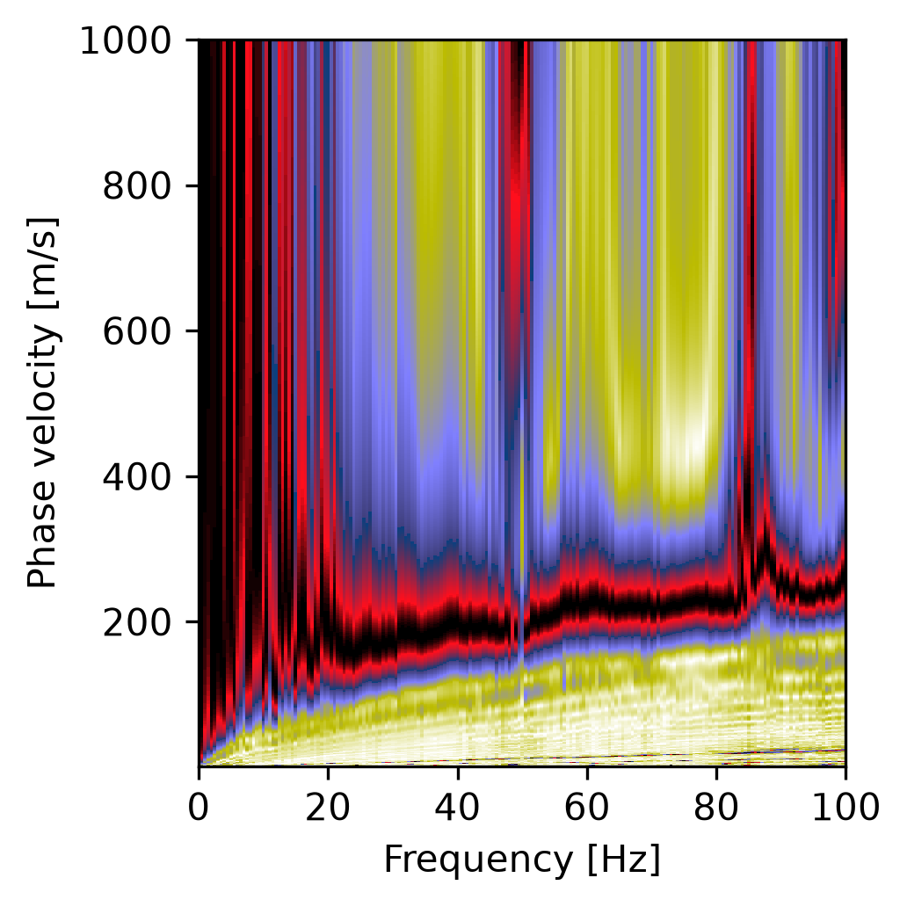

# G2: dispersion image QC, per window

Runs on each window's image (`xmid_<x>/DispersionImage_0000.hdf5`), before any picking. Code:
`src/paco/qc/g2_image.py`; thresholds: `image` in `qc_config.json` (`ImageThresholds`), and
G1's (`signal`) for a passive or passive-active window's stacked correlations and fk selection,
measured by sigpipe's `sigpipe.masw.quality.measures` (below); the image's measures are
sigpipe's `measure_image` (`sigpipe.masw.quality.image`, `ImageThresholds` over its
`ImageLimits`; PAC's runs measured alike), each naming what it describes (`of`: the image, the
stacked correlations as a signal and their spectrum, the fk selection); tests:
`tests/test_qc_image.py`, on analytic images (Gaussian ridges over the noise floor).

## What it checks

The noise floor of a phase-shift image is 1 / sqrt(N) for N receivers: random phases sum to
about that, not to 0. The most a plane wave gives is 1.

| Metric | Threshold (default) | Why |
|---|---|---|
| `coherent_columns` | a column (one frequency) is coherent when its peak lies 30 % of the way from the floor to 1; at least 50 % of the columns | The share of the band with a ridge to pick. A level, not a multiple of the floor: with 5 receivers the floor is 0.45, and 3 x the floor is above 1 |
| `ridge_at_vmin`, `ridge_at_vmax` | at most 20 % of the coherent columns peak within 2 % of the velocity range of the grid's edge; at the top, only the columns where the window tells vmax from an infinite velocity count (f x aperture above vmax, the slowness resolution 1 / (f L)) | The velocity range is too narrow: vmax x 1.5, vmin / 1.5 but never under 30 m/s, and at 30 m/s already the flag is kept (under it, the floor would raise again what the retry lowers: 1 -> 30 -> 20 -> 30 m/s); or, at a vmin below 30 m/s, an artifact (a correlation's zero lag): then the range starts at 30 m/s. Below f = vmax / L a peak at vmax is energy with no moveout, noise common to every trace, not a ridge beyond the grid |
| `band_at_fmin`, `band_at_fmax` | the coherent band must not reach the image's first or last frequency | The band may go on beyond the image. Both are kept, not retried: `band_at_fmax` because widening the band makes G3 worse on the demo (below), `band_at_fmin` because the picker stops where the ridge breaks (below) |
| `competing_ridges` | a second local maximum reaching 70 % of the first, at least 15 % away in velocity, in at most 70 % of the coherent columns | A higher mode dominating: kept, the fundamental mode being picked as the slowest ridge whatever the modes picked (picking two modes changes nothing); or, when the first ridge lies below the aliasing limit v = 2 dx f, an alias: the window's picking stops where the alias starts |
| `band_share_of_usable` | the coherent band at least half of G1's usable band (the narrowest over the window's records) within the image's frequencies (a usable band past the image's is `band_at_fmax`'s, not counted twice) | The image does not use all the records offer: reported (`narrower_than_usable`, kept) |
| `aliased_ridges` | the share of the columns with a second ridge whose ridge lies under 2 dx f | Reported: an alias, not a mode, below which `competing_ridges` stops the picking |

Actions: a change of the line's settings, the line loop's to try for every window (`loop.md`):
the phase shift's (`dispersion.vmin`, `vmax`; a passive line's fk `selection.threshold`), or the
preprocessing's (a surface-wave mute, for a line not muted yet); at an alias, the window's
picking stops below it (`picking.fmax`, within a band the user gave), the image staying the
line's; the band flags and a
second ridge are kept. Verdict: `reject` when a window's correlations or fk selection fall short
with all its data stacked (below), `retry` when a flag asks a change of the line's settings (not
kept by the line loop, the flag stays as a note and the window passes; of a setting the user
gave, the window is rejected, `locked`), `pass` otherwise (kept flags and the picking's limit
only). `kept`: the coherent band and the
window's receivers.

**The grid comes first.** With a velocity range too narrow for the ground (vmax at 150 m/s where
the demo reaches 290), the correlation's artifact at 1 m/s outweighs the truncated ridge, and a
G2 looking below 30 m/s takes it for an alias and cuts the band to 12 Hz. The edge,
competing-ridge and alias checks look above `vmin_floor` (30 m/s) only, and no second ridge is
judged while a ridge sits on the grid's edge (`docs/gates/loop.md`).

**The band is capped, never widened** (the measurements are in `S2_rules.md`): on active_p1, G3
passes 17 of 19 windows at PAC's 100 Hz, 15 at 150 Hz (fmax x 1.5) and 6 at 324 Hz (G1's usable
band), since above 100 Hz a second ridge competes and the picker jumps. So `band_at_fmax` and
`narrower_than_usable` are reported, never retried, and the coherence rules cap fmax at G1's
usable band before S2.

## On the demo profile

`active_p1`, windows of 24 receivers every 24, PACo's defaults, the four windows alike:

| Metric | xmid 2.88 | Passed |
|---|---|---|
| `coherent_columns` | 0.995 | yes |
| `ridge_at_vmin` | 0.01 | yes |
| `ridge_at_vmax` | 0.04 | yes |
| `band_at_fmin` | no | yes |
| `band_at_fmax` | reached | **no** |
| `competing_ridges` | 0.56 | yes |



The summary the agent reads:

```
G2: 4 pass
G2 band_at_fmax, xmid 2.88-20.88 (4): The coherent band reaches the image's highest frequency:
  the band may go on beyond it. -> keep: fmax stays: a wider band let other ridges compete
```

The records are usable to 324 Hz while PAC's default image stops at 100 Hz: widening `fmax`
would lose curves (above).

With windows of 5 receivers (every receiver, 92 windows): 92 to 99 % of the columns coherent,
87 to 95 % with a second ridge (the 1 m aperture cannot separate ridges), the band flags as
above. `passive_p1`, 24-receiver windows: 20 to 60 % of the columns peak at vmin = 1 m/s, an
artifact, so the range is moved to start at 30 m/s; two windows peak at vmax as well; one shows
aliasing.

## On analytic images (the tests)

A Gaussian ridge along a known M0 over the floor of 48 receivers, 10 to 40 Hz:

- a ridge that fades at 15 and 35 Hz: pass, band 15–35 Hz, 41 of 61 columns coherent;
- the same ridge 900 m/s higher, beyond the grid's 1,000 m/s: `ridge_at_vmax` -> vmax 1,500;
- a ridge reaching 40 Hz: `band_at_fmax`, kept, pass; reaching 10 Hz: `band_at_fmin`, kept, pass;
- a second ridge at 1.8 x M0 with 7/8 of its height: `competing_ridges`, kept, pass; at 3/8 of
  its height, no flag;
- on 10 receivers 5 m apart, a second ridge below the aliasing limit 2 dx f: `aliasing` -> fmax
  at 21.5 Hz, where M0 = 150 + 250 exp(-f/15) drops below 10 f;
- a ridge on 11 of 61 columns: `weak_coherence`; an empty image: `no_coherent_energy`; both
  a mute, or, the records muted already, kept, pass;
- energy at 1 m/s: an artifact, the range to start at 30 m/s; a ridge at the lowest velocity
  of a grid from 45 m/s: vmin lowered to 30 m/s; of a grid from 30 m/s: kept, nothing lower
  to try;
- a passive window's correlations at 2.1 dB: `noisy_correlations`, its fk threshold 0.1 ->
  0.05; a passive-active window's at 2.1 dB and a coherence of 0.4: rejected; a passive
  window's fk selection keeping 1 of its 200 segments (0.5 %): `few_segments_kept`, retry;
  keeping 4 (2 %): pass;
- a band of 20 Hz against a usable band of 75 Hz: `narrower_than_usable`, kept, pass.

## A passive or passive-active window's correlations and fk selection

One SNR limit holds for every signal, and G2 asks for no retry that could not change the image.

- **A window's stacked correlations, saved beside its image, are measured as a record is**
  (sigpipe's `measure_signal` from the virtual source, its own trace aside), against G1's
  limits (`signal`): a usable band reaching 2 Hz into the window's dispersion band, and in that
  part of it a median SNR of 6 dB and a coherence of 0.5. Each lag is divided by the square
  root of the share of the samples it sums (n - k of n at lag k): a causal correlation sums
  fewer samples the later its lag, and noise alone, correlated and stacked, reads 4 to 5 dB
  unscaled, about 2 dB scaled. Falling short, `noisy_correlations`: a passive window's phase
  shift again with more of the data (`more_data`: its fk threshold halved, while over 0.01;
  longer segments are no more data, the same record cut in fewer pieces), else rejected (a
  passive-active window stacks every shot within reach already). Dead, clipped or NaN traces
  among them: `bad_correlations`, kept (a receiver the records' checks leave to the line).
- **A passive window's fk selection** (as its job saved it, `Selection_0000.json`; sigpipe's
  `selection_measures`): `fk_segments` and `fk_flipped` reported, `fk_kept` at least 0.01
  (`min_fk_kept_share`: good segments are rare; S2's segment trials hold the same floor); under
  it, `few_segments_kept`, the same retry, then rejected.
- **A muted passive-active line's correlations are measured before the muting**: a mute zeroes
  each record's noise after the slowest arrival, and the correlations' with it, whose SNR would
  read some 300 dB whatever the data. They are made again from the window's records before
  their muting, as its latest attempt stacked them (`RecordsBeforeMuting`, sigpipe's
  `window_correlations`); without those records, the SNR and the band are not measured.
- **An image mostly noise asks for a mute only when its records are not muted yet**
  (`no_coherent_energy`, `weak_coherence`); muted, or on a passive line (no muting to try), it
  is flagged and kept, the later gates judging its pick.
- A `qc_config.json` saved by an older version still reads: its `image.min_virtual_shot_snr_db`
  and `signal.min_correlation_snr_db` are dropped.

## Design notes

- **A second ridge is flagged on more than 70 % of the coherent columns**: good 24-receiver
  windows of the demo hold one in 52 to 60 % of theirs, 5-receiver ones in 87 to 95 %.
- **The top edge counts only where the window resolves it.** On `passive_p1` with 24-receiver
  windows (5.75 m), half the coherent columns peak at the grid's top. Counted everywhere, G2
  widens the grid from 1,500 to 2,250 then 3,375 m/s, the peak follows the edge each time, and
  three of the four windows are rejected once the budget is spent. A 5.75 m window cannot tell
  1,500 m/s from an infinite velocity below 261 Hz: that energy has no moveout (noise common to
  every trace, which one-bit normalization keeps), and the picker, which follows the lowest
  ridge, ignores it (22 of 27 trial windows pass G3). Counted only above f = vmax / L, the four
  windows pass G2 and three give a curve. The demo's narrow grid (vmax 250 m/s, the scenario
  `narrow_velocities`) is still widened: its columns above 43 Hz count.
- **`band_at_fmin` is kept, not retried.** On `active_p2` (96 receivers every 1.5 m, 97 shots),
  every short window's band reaches the image's lowest frequency; with fmin lowered to 1 Hz,
  the band still reaches it, and the retries spend the run's budget: 68 of 92 windows rejected
  before any picking. The low end is the picker's: it stops where the ridge breaks (continuity)
  and where the window resolves no velocity (a plane wave's 1 % contrast), which lowering fmin
  cannot change. A single retry before keeping it takes 92 of the run's 184 retries on
  `active_p2`.
- **A passive-active image peaking at the grid's top velocity asks for the mute first.** A shot
  is correlated whole (the passive-active chain cuts no surface-wave window of its own: the
  muting's velocities cut the same), so a record's noise common to every trace peaks at the
  grid's top. `ridge_at_vmax` then asks for the surface-wave mute (80 to 1,500 m/s, each
  record's pulse kept after the slowest arrival (G1), placed from the files' trigger) before a
  wider grid, unless the line's records are muted already: the line loop tries that mute
  (`loop.md`).
