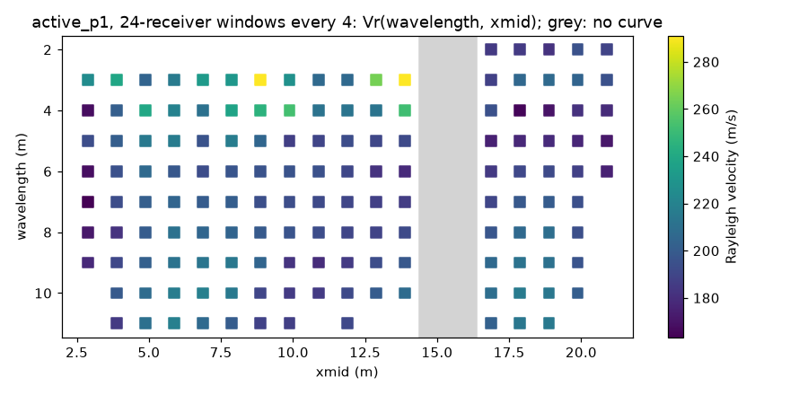

# G4: curve profile QC, over the line

Runs once over the whole line, after the picking, on the M0 curves whose latest pick passed G3
(read back from each window's `DispersionCurves_0000.csv`). Its verdict is the go/no-go for the
inversion (milestone 14's `invert` reads it from the QC log). Code: `src/paco/qc/g4_profile.py`,
called by `judge_line` in `judging.py`; thresholds: `profile` in `qc_config.json`
(`ProfileThresholds`); tests: `tests/test_qc_profile.py`, on synthetic lines.

## What it checks

The pseudo-section Vr(wavelength, xmid). Each curve is compared with its neighbours on either
side, `neighbours / 2` on each (2 by default), at the wavelengths the side's median curve holds:

- a curve **fits** a side when its median relative misfit to the side's median curve, over the
  wavelengths they share, is within `max_misfit`;
- a curve is **off** a side only when the side is full (2 curves: a side of one curve agrees with
  itself), the side's curves agree with each other (each within half of `max_misfit` of their
  median) and the curve lies beyond `max_misfit`;
- a side counts only when it shares at least `min_shared_points` wavelengths with the curve.

| Situation | Flag | Action |
|---|---|---|
| off every side it can be off, fits none | `outlier` (retry) | pick again with the corridor centred on the neighbours' median curve: `picking {"guide": [[f, v], ...]}`, then G3 again |
| off one side, fits the other | `shared_change` (keep) | a change in the ground shared with the neighbours: kept, reported |
| fits no side, off none (the sides disagree among themselves, or share too little) | `no_neighbours` (keep) | nothing to judge the curve against |
| fits a side, off none | pass | |

An isolated outlier is one window off neighbours that agree with each other; a run of two or
more changed windows makes their neighbours disagree, so nothing in it is an outlier. The line
itself gets a result (unit `line`): the xmids without a curve as `gaps`, and `uneven_depth`
when the curves' longest wavelengths (the depth of investigation) spread by more than
`max_depth_spread` (MAD over median) along the line; both kept. The line is rejected only when
no curve passed G3. Never a smoothing: the guide changes where the picker looks, not the pick.

| Threshold | Default | Why |
|---|---|---|
| `neighbours` | 4 (2 a side) | Two curves a side can agree or disagree; one cannot |
| `max_misfit` | 0.15 | The demo's neighbours sit within 2 to 13 % of each other (below); an outlier is well beyond |
| `min_shared_points` | 3 | Fewer shared wavelengths say nothing |
| `max_depth_spread` | 0.5 | The longest wavelengths of the demo's curves are all 10 to 11 m (spread 0) |

## On the demo profile

`active_p1`, windows of 24 receivers every 4 receivers (19 windows), PACo's defaults with the
picking's `max_wavelength` at 2 window lengths (2026-09-24):



| Window | G3 | G4 misfit | sides |
|---|---|---|---|
| 2.88 | pass | 0.133 | 1 |
| 3.88 | pass | 0.069 | 1 |
| 4.88 | pass | 0.126 | 2 |
| 5.88–13.88 | pass | 0.026–0.071 | 2 |
| 14.88 | retry, `mode_jump` (53 %) | | |
| 15.88 | retry, `mode_jump` (31 %) | | |
| 16.88–18.88 | pass | 0.046–0.057 | 2 |
| 19.88 | pass | 0.024 | 1 |
| 20.88 | pass | 0.037 | 1 |

17 curves within 2 to 13 % of their neighbours, no outlier, no shared change; the two windows
whose pick jumps between modes are the gaps. The summary the agent reads:

```
G3: 17 pass, 2 retry
G4: 18 pass
G3 mode_jump, xmid 14.88-15.88 (2): A 53% step between consecutive points: the pick jumped
  onto another mode. Track with a narrower corridor. -> picking {"corridor":0.1}
G4 gaps, line: No curve at xmid 14.88-15.88 (2): the section has gaps there. -> keep: the gaps
  stay in the report
```

With 4 windows every 24 receivers (the tests' line): every curve has one neighbour a side, so
no side is evidence; xmid 8.88 is 28 % off both its neighbours and gets `no_neighbours`, not
`outlier`: three curves 6 m apart cannot tell an outlier from geology. With PACo's default
windows of 5 receivers, no curve passes G3 (see `G3.md`) and the line is rejected:
"No curve at xmid 0.50-23.25 (92)".

## On synthetic lines (the tests)

Curves v = 150 + 8 λ over 3 to 30 m, eight xmids:

- all alike: every curve and the line pass, misfit 0, two sides compared (one at the ends);
- one curve 30 % higher: `outlier`, on both sides, with the guide along 150 + 8 λ, sorted by
  frequency; its neighbours pass (their other side holds the outlier and does not agree);
- the first curve 30 % lower: `outlier` on its only side;
- a step of 50 % from the fifth xmid on: `shared_change` on the two curves at the step, kept;
  nothing else flagged;
- three curves at 150 % in the middle: `shared_change` on both edges of the run and on their
  outer neighbours; the middle one `no_neighbours` (each of its sides disagrees);
- a curve of 2 points: `no_neighbours`; a line of three curves: `no_neighbours` for the middle
  one even 30 % off, `outlier` once it has two on each side;
- gaps at xmids 6, 7 and 10: "xmid 6.00-7.00 (2), 10.00 (1)"; curves half of which stop at 6 m
  while the others reach 30 m: `uneven_depth`; no curve at all: the line rejected.

## To judge

- `max_misfit` at 15 %: the demo's neighbours agree within 2 to 7 % in the middle of the line
  and 13 % at its ends. Should the limit be tighter (10 %), at the risk of re-picking curves that
  only differ by a true lateral change?
- The action for an outlier is one re-pick along the neighbours' median (then G3 again, within
  the budget of 2 retries per gate and window). Should a curve that stays off after that be
  rejected from the inversion, or kept and reported?
- The trend flags of G3 (velocity falling with wavelength on 11 of the 17 curves at 2 to 11 m)
  are kept as geology; G4 does not use them. Should a run of inverse curves be reported at the
  line level too?
